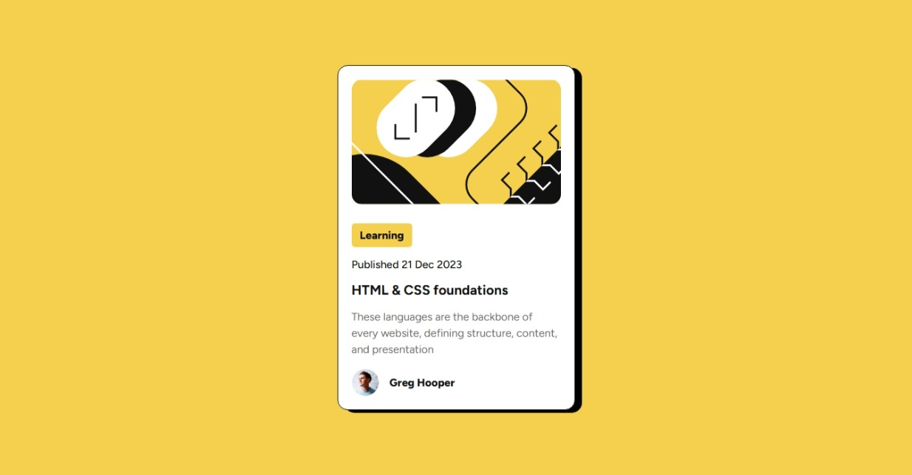

# Frontend Mentor - Blog preview card solution

This is a solution to the [Blog preview card challenge on Frontend Mentor](https://www.frontendmentor.io/challenges/blog-preview-card-ckPaj01IcS). Frontend Mentor challenges help you improve your coding skills by building realistic projects. 

## Table of contents

- [Overview](#overview)
  - [The challenge](#the-challenge)
  - [Screenshot](#screenshot)
  - [Links](#links)
- [My process](#my-process)
  - [Built with](#built-with)
  - [What I learned](#what-i-learned)
  - [Continued development](#continued-development)
  - [Useful resources](#useful-resources)
- [Author](#author)
- [Acknowledgments](#acknowledgments)

**Note: Delete this note and update the table of contents based on what sections you keep.**

## Overview

### The challenge

Users should be able to view a blog card with an image, title, description, author info, and tag. Hover and focus states should be visible.

### Screenshot

### Links

- Solution URL: [https://github.com/ZackDora/blog-preview-card-main](https://github.com/ZackDora/blog-preview-card-main)
- Live Site URL: [https://zackdora.github.io/blog-preview-card-main/](https://zackdora.github.io/blog-preview-card-main/)

## My process

### Built with

- HTML
- CSS (Flexbox, Responsive layout)

### What I learned

- How to use box-shadow to achieve the required effect of the challenge
- Dealing with images in responsive design

## Author

- Zack Yang
- Frontend Mentor - [@ZackDora](https://www.frontendmentor.io/profile/ZackDora)
- Facebook - [Dương Trí Phú](https://www.facebook.com/ytp109)
